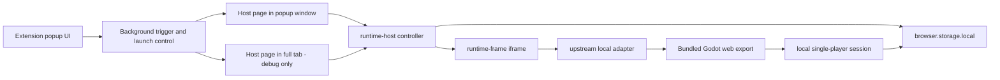

# ForkOrFry

[](https://github.com/bdtran2002/ForkOrFry/actions/workflows/ci.yml)
[](./README.md)
[](https://github.com/bdtran2002/ForkOrFry/releases)
[](./extension)
[](./extension)
[](./extension/public/upstream/hurrycurry-web)
[](./LICENSE)

ForkOrFry is a local-first browser-extension fork of Hurry Curry for single-player play.

It is still very beta. The game is not fully working yet, but the direction is clear: run inside an extension-owned surface, keep progress local, and remove the server dependency from the shipped experience.

**Project links:** [Contributing](./CONTRIBUTING.md) · [Security](./SECURITY.md) · [Code of Conduct](./CODE_OF_CONDUCT.md) · [Releases](https://github.com/bdtran2002/ForkOrFry/releases)

Need to report something? [Open a bug report](https://github.com/bdtran2002/ForkOrFry/issues/new?template=bug_report.md) or [suggest a feature](https://github.com/bdtran2002/ForkOrFry/issues/new?template=feature_request.md).

## What this project is

- a browser extension build, not a full-tab web app
- a single-player fork with bots replacing remote players over time
- a local-only runtime that persists progress inside the browser
- an upstream-derived port of Hurry Curry, trimmed for the burger level

## Current status

Latest prerelease: [`v0.0.1-beta.1`](https://github.com/bdtran2002/ForkOrFry/releases/tag/v0.0.1-beta.1)

What works today:

- the extension can load the bundled Godot web export offline
- the host shell can open inside the browser extension UI
- local bootstrap, pause/resume, checkpoint, and reset flows are in place
- the real game scene can be reached from the extension runtime path

What is still rough:

- gameplay is not yet fully local-authoritative after spawn
- multiplayer/server assumptions are still being removed from the live runtime
- the polished player-facing experience is still a work in progress

## How to try it

This repo currently uses **npm** for the extension workflow.

1. Run `npm install` in `extension/`.
2. Run `npm run build` in `extension/`.
3. Open `about:debugging#/runtime/this-firefox` in Firefox.
4. Click **Load Temporary Add-on**.
5. Select `extension/dist/firefox-mv3/manifest.json`.
6. Open the extension popup and start from the host surface.

## Repository layout

- `extension/` — extension app, popup UI, runtime host, runtime frame, tests, packaging scripts
- `docs/` — AMO and project documentation
- `.upstream-reference/` — read-only upstream reference copy
- `LICENSE` / `THIRD_PARTY_NOTICES.md` — licensing and attribution

## For developers

### Architecture



The intended shipped surfaces are the popup and side-panel-style extension flow around the runtime host. The full-tab path stays available only as a temporary debug surface for transfer/testing and is not the production runtime target.

### Setup

- Node.js `^20.19.0 || >=22.12.0`
- npm
- `zip` / `unzip`
- Firefox for temporary loading and manual verification

### Install

```bash
cd extension
npm install
```

### Common commands

```bash
cd extension
npm run dev
npm run build
npm test
npm run lint
npm run export:godot-web
npm run sync:godot-web-export -- /absolute/path/to/godot-web-export
npm run package:firefox
```

The bundled Godot web export lives under:

```text
extension/public/upstream/hurrycurry-web/
```

### Godot export workflow

Two workflows matter right now:

- `npm run sync:godot-web-export -- /absolute/path/to/godot-web-export`
  - copies an already-exported Godot web build into the extension package
- `npm run export:godot-web`
  - builds a writable temp copy of the upstream client
  - overlays tracked local patches from `extension/upstream/hurrycurry-client-overlay/`
  - exports a fresh Godot web build
  - syncs it into `extension/public/upstream/hurrycurry-web/`

The sync/export path writes a `manifest.json` so `runtime-frame.html` can load the bundled export offline.

### Manual verification

1. Load the temporary add-on in Firefox.
2. Open the toolbar popup and click **Arm idle trigger**.
3. Let Firefox enter the configured idle state.
4. Return to activity and confirm the host opens or refocuses.
5. Use **Move to full tab** only as a debug/dev check and confirm the run transfers.
6. Close and reopen the active surface to confirm checkpoint resume.

## Contributing

- keep changes aligned with the extension-hosted, single-player, local-only direction
- do not reintroduce server or multiplayer runtime requirements
- do not add Docker or Rust-server runtime dependencies to the shipped path
- preserve the host/runtime seam while replacing the child runtime
- prefer small, verifiable slices
- update docs when the product direction changes materially

## License

The upstream `hurrycurry` project is AGPL-3.0-only. This repo is being prepared for AGPL-3.0-only distribution as the safest baseline for bundling and modifying that code for local extension distribution.
