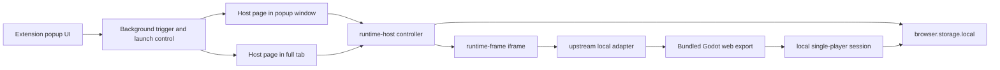

# ForkOrFry

[](https://github.com/bdtran2002/ForkOrFry/actions/workflows/ci.yml)
[](./LICENSE)

ForkOrFry is a browser-extension build of Hurry Curry being adapted into a local, single-player game.

It runs inside an extension-owned surface, keeps state local, and avoids any runtime server dependency.

## Overview

ForkOrFry is aimed at a simple version of the game:

- install it as a browser extension
- launch it in an extension-owned window or tab
- keep the run local to the browser
- stay focused on single-player play

The current build supports two host surfaces:

- a popup-sized host window
- a larger full-tab host

Only one host surface should be active at a time. Moving from the popup window to the full tab is meant to carry the same run forward instead of creating a second session.

## Current status

ForkOrFry is still in active migration to the real upstream Godot runtime.

Right now the project can:

- bundle and load a real Godot web build offline
- boot through the extension host shell
- pass a local bootstrap payload into the embedded runtime
- reach the real game scene and spawn the local player in `burgers_inc`
- preserve checkpoint, pause, resume, reset, and host handoff behavior

What is not finished yet:

- full local-authoritative gameplay after spawn
- replacing the remaining multiplayer/server assumptions in the live runtime
- polishing the shipped player-facing experience

## Highlights

- browser-extension delivery instead of a separate native install
- local saves and checkpoint-based resume behavior
- popup-window and full-tab host support
- offline bundled Godot web runtime

## Repository layout

- `extension/` — extension app, popup UI, runtime host, runtime frame, tests, packaging scripts
- `.github/workflows/` — CI and packaging workflows
- `docs/` — AMO and project documentation
- `.upstream-reference/` — read-only upstream reference copy
- `LICENSE` / `THIRD_PARTY_NOTICES.md` — licensing and attribution

## For developers

### Architecture



### Developer setup

### Requirements

- Node.js `^20.19.0 || >=22.12.0`
- npm
- `zip` / `unzip`
- Firefox for temporary loading and manual verification

### Install

```bash
cd extension
npm install
```

### Common commands

```bash
cd extension
npm run dev
npm run build
npm test
npm run lint
npm run export:godot-web
npm run sync:godot-web-export -- /absolute/path/to/godot-web-export
npm run package:firefox
```

The bundled Godot web export lives under:

```text
extension/public/upstream/hurrycurry-web/
```

### Godot export workflow

Two workflows matter right now:

- `npm run sync:godot-web-export -- /absolute/path/to/godot-web-export`
  - copies an already-exported Godot web build into the extension package
- `npm run export:godot-web`
  - builds a writable temp copy of the upstream client
  - overlays tracked local patches from `extension/upstream/hurrycurry-client-overlay/`
  - exports a fresh Godot web build
  - syncs it into `extension/public/upstream/hurrycurry-web/`

The sync/export path writes a `manifest.json` so `runtime-frame.html` can load the bundled export offline.

### Temporary loading in Firefox

1. Run `npm run build` in `extension/`
2. Open `about:debugging#/runtime/this-firefox`
3. Click **Load Temporary Add-on**
4. Select `extension/dist/firefox-mv3/manifest.json`

### Manual verification

### Host shell

1. Load the temporary add-on in Firefox
2. Open the toolbar popup and click **Arm idle trigger**
3. Let Firefox enter the configured idle state
4. Return to activity and confirm the popup-window host opens or refocuses
5. Use **Open current surface** to verify the active surface can be launched directly
6. From the popup-window host, use **Move to full tab** and confirm the run transfers
7. Close and reopen the active surface to confirm checkpoint resume still works
8. Use **Clear state** to confirm both trigger state and runtime-host state reset cleanly

### Godot runtime

1. Run `npm run export:godot-web && npm run build` in `extension/`
2. Load the extension temporarily in Firefox
3. Open the popup-window host or full-tab host
4. Confirm the bundled Godot export loads inside the runtime-frame host shell
5. Confirm the local bridge boot sequence reaches the real game runtime
6. Verify the local player spawns in `burgers_inc`
7. Probe movement, interactions, and pause/resume behavior

## Contributing

- keep changes aligned with the extension-hosted, single-player, local-only direction
- do not reintroduce server or multiplayer runtime requirements
- do not add Docker or Rust-server runtime dependencies to the shipped path
- preserve the host/runtime seam while replacing the child runtime
- prefer small, verifiable slices
- update docs when the product direction changes materially

## License

The upstream `hurrycurry` project is AGPL-3.0-only. This repo is being prepared for AGPL-3.0-only distribution as the safest baseline for bundling and modifying that code for local extension distribution.
