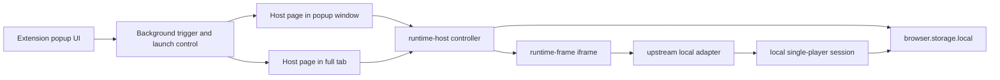

# ForkOrFry

[](https://github.com/bdtran2002/ForkOrFry/actions/workflows/ci.yml)
[](./LICENSE)

ForkOrFry is now an **extension-distributed local game container**.

The product direction is:

- users install it from Chrome/Firefox as an extension
- the game lives inside the extension
- the runtime is **single-player only**
- all gameplay state is **local**
- there is **no server dependency**

The current branch keeps the extension host shell and runtime boundary that were added during the first pivot. The child runtime is still a custom TypeScript burger-session scaffold and is **not** the final game path.

## Product definition

ForkOrFry will ship as a browser extension that bundles a modified fork of [`hurrycurry`](https://codeberg.org/hurrycurry/hurrycurry.git) and runs it inside an extension-owned UI surface.

The shipped experience must:

- run inside the extension, not a separate app install
- work as a local single-player game
- remove multiplayer and server runtime dependence
- keep game state and persistence local to the extension
- support both:
  - a **popup-window host** for the current idle/activity flow
  - an optional **full-tab host** that expands the same run into a larger surface

There should only be **one active host surface at a time**. Moving from popup window to full tab transfers the current run instead of creating a second live session.

## Current state

### What already exists

- Firefox extension scaffolding via WXT
- CI for lint, tests, build, and Firefox packaging
- idle → renewed activity trigger flow in the extension background worker
- an extension-owned runtime host page
- a host/runtime iframe boundary with typed messaging
- checkpoint storage owned by the host shell
- pause, resume, reset, and shutdown plumbing
- popup-window host and full-tab host support

### What is still temporary

- `extension/src/features/runtime-frame/burger-runtime.ts` is still a custom TypeScript burger scaffold
- gameplay logic is still local scaffolding, not the real upstream game path
- upstream `hurrycurry` client behavior has not been integrated yet
- server/multiplayer coupling in the real upstream code has not been removed yet

### What should not keep growing

The custom burger runtime is now reference/scaffolding only. Do not keep deepening it unless a change directly supports the upstream local-runtime path.

## Target architecture



## What stays vs what gets replaced

### Keep

- `extension/src/core/background.ts`
- `extension/src/core/state.ts`
- `extension/src/core/messages.ts`
- `extension/src/features/popup/*`
- `extension/src/features/runtime-host/*`
- the extension-owned host page
- the host/runtime contract
- checkpoint persistence and resume behavior

### Replace

- the child runtime behind `runtime-frame.html`
- the custom reducer-driven burger-session gameplay path

## Code structure plan

### Stable shell

```text
extension/src/
├── core/
│   ├── background.ts        # idle/activity trigger, launch control, surface tracking
│   ├── messages.ts          # popup/background/host message shapes
│   └── state.ts             # extension-owned persistent state
├── features/
│   ├── popup/               # launcher/status UI
│   └── runtime-host/        # host shell, controller, contract, checkpoint store
└── entrypoints/
    ├── popup/
    ├── takeover/            # current host page entrypoint
    └── runtime-frame/       # child runtime entrypoint
```

### Transitional child runtime

```text
extension/src/features/runtime-frame/
├── upstream-runtime.ts            # current runtime-frame adapter shell for bundled web export
├── upstream-export.ts             # export manifest parsing + entry resolution
├── upstream-checkpoint.ts         # adapter-shell checkpoint serializer
├── burger-runtime.ts              # current scaffold, not final direction
├── burger-session-reducer.ts      # scaffold only
├── burger-session-state.ts        # scaffold only
├── checkpoint.ts                  # scaffold checkpoint serializer
└── burger-level.ts                # scaffold burger-level data
```

### Planned replacement path

```text
extension/src/features/runtime-frame/
├── upstream-runtime.ts            # next runtime entrypoint target
├── upstream-session.ts            # local authoritative session adapter
├── upstream-checkpoint.ts         # checkpoint serialization for upstream-shaped state
├── upstream-data.ts               # normalized checked-in burger-level/map data
└── burger-runtime.ts              # kept only as reference during migration
```

## Near-term implementation plan

### Slice 1 — host surfaces

- keep the popup-window host as the default idle/activity surface
- support moving the current run into a full-tab host
- keep one active host surface at a time
- preserve checkpoint/resume across the handoff

### Slice 2 — upstream local adapter bootstrap

- add an upstream-shaped local adapter in `extension/src/features/runtime-frame/`
- point `extension/src/entrypoints/runtime-frame/main.ts` at that adapter
- use normalized checked-in burger-level/map data first
- prove local boot, movement/collision baseline, and host checkpoint compatibility

### Slice 3 — remove server startup assumptions

- strip or bypass multiplayer/server-dependent startup paths
- replace network authority with local single-player authority
- stop requiring websocket/session bootstrap for runtime

### Slice 4 — single-player systems

- replace remote players with local bots or single-player-specific logic
- keep gameplay local and offline
- lock the first shipped build to the burger level only

### Slice 5 — final runtime path

- decide when the Godot/WASM runtime lands inside the same host shell
- keep the extension-hosted shell architecture unchanged while swapping runtimes

## Hard constraints

- do not use Docker
- do not build or deploy the Rust server
- do not preserve multiplayer networking as a runtime feature
- treat server code as reference only
- keep the client/runtime authoritative for shipped gameplay state
- keep the shipped runtime inside an extension-owned surface

## Repository layout

- `extension/` — extension app, runtime host, popup UI, tests, packaging scripts
- `.github/workflows/` — CI and packaging workflows
- `docs/` — pivot notes, analysis, and AMO reviewer docs
- `README.md` — project definition, current state, and implementation plan
- `LICENSE` / `THIRD_PARTY_NOTICES.md` — licensing and attribution

## Developer setup

### Requirements

- Node.js `^20.19.0 || >=22.12.0`
- npm
- `zip` / `unzip`
- Firefox for temporary loading and manual verification

### Install

```bash
cd extension
npm install
```

### Common commands

```bash
cd extension
npm run dev
npm run build
npm test
npm run lint
npm run sync:godot-web-export -- /absolute/path/to/godot-web-export
npm run package:firefox
```

The runtime adapter expects copied web export files under:

```text
extension/public/upstream/hurrycurry-web/
```

The sync script writes a `manifest.json` there so `runtime-frame.html` can load the bundled export offline from inside the extension package.

### Temporary loading in Firefox

1. Run `npm run build` in `extension/`
2. Open `about:debugging#/runtime/this-firefox`
3. Click **Load Temporary Add-on**
4. Select `extension/dist/firefox-mv3/manifest.json`

## Manual verification

### Current host shell

1. Load the temporary add-on in Firefox
2. Open the toolbar popup and click **Arm idle trigger**
3. Let Firefox enter the configured idle state
4. Return to activity and confirm the popup-window host opens or refocuses
5. Use **Open current surface** to verify the active surface can be launched directly
6. From the popup-window host, use **Move to full tab** and confirm the run transfers
7. Close and reopen the active surface to confirm checkpoint resume still works
8. Use **Clear state** to confirm both trigger state and runtime-host state reset cleanly

## Contributor guidance

- keep changes aligned with the extension-hosted, single-player, local-only direction
- do not reintroduce server or multiplayer runtime requirements
- preserve the host/runtime seam while replacing the child runtime
- prefer small, verifiable slices
- update docs when the product direction or current migration state changes materially

## Licensing direction

The upstream `hurrycurry` repo is AGPL-3.0-only. Since this project is intended to vendor and modify that code for local distribution inside the extension, this repo is being prepared for AGPL-3.0-only distribution as the safest baseline.
