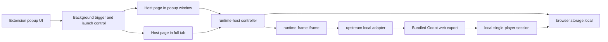

# ForkOrFry

[](https://github.com/bdtran2002/ForkOrFry/actions/workflows/ci.yml)
[](./LICENSE)

ForkOrFry is now an **extension-distributed local game container**.

The product direction is:

- users install it from Chrome/Firefox as an extension
- the game lives inside the extension
- the runtime is **single-player only**
- all gameplay state is **local**
- there is **no server dependency**

The current branch keeps the extension host shell and runtime boundary that were added during the first pivot. The child runtime has now been switched over to a **real bundled Godot web export path** with a local bridge/bootstrap adapter, but it is still mid-migration and not yet a fully shipped single-player game.

## Product definition

ForkOrFry will ship as a browser extension that bundles a modified fork of [`hurrycurry`](https://codeberg.org/hurrycurry/hurrycurry.git) and runs it inside an extension-owned UI surface.

The shipped experience must:

- run inside the extension, not a separate app install
- work as a local single-player game
- remove multiplayer and server runtime dependence
- keep game state and persistence local to the extension
- support both:
  - a **popup-window host** for the current idle/activity flow
  - an optional **full-tab host** that expands the same run into a larger surface

There should only be **one active host surface at a time**. Moving from popup window to full tab transfers the current run instead of creating a second live session.

## Current state

### What already exists

- Firefox extension scaffolding via WXT
- CI for lint, tests, build, and Firefox packaging
- idle → renewed activity trigger flow in the extension background worker
- an extension-owned runtime host page
- a host/runtime iframe boundary with typed messaging
- checkpoint storage owned by the host shell
- pause, resume, reset, and shutdown plumbing
- popup-window host and full-tab host support
- a bundled Hurry Curry Godot web export inside `extension/public/upstream/hurrycurry-web/`
- a runtime-frame adapter that loads the bundled export offline inside the extension
- a parent ↔ embedded HTML bridge handshake for bootstrap/pause/resume messages
- a tracked Godot overlay workflow for patching the read-only upstream client before export
- a first local bridge route inside the Godot client (`entry.gd` → `game.gd` → `multiplayer.gd`)
- a richer local `burgers_inc` bootstrap payload with real tile/item registries, map changes, and spawn position
- live-boot proof that the local player reaches the real `game.gd` packet consumer path in the exported web build

### What is still temporary

- the TypeScript burger runtime files still exist as historical scaffold/reference, but they are no longer the active runtime path
- the current local bridge only injects the first bootstrap packet stream; it does not yet provide a full local-authoritative simulation loop
- downstream gameplay/input/runtime behavior after initial spawn still needs real probing and fixes
- server/multiplayer assumptions still exist in upstream code and are being patched selectively through the overlay path
- the Godot-side JS bridge globals were not reliable for inspection, so current debugging relies mainly on console instrumentation

### What should not keep growing

The custom burger runtime is now reference/scaffolding only. Do not keep deepening it unless a change directly supports the upstream local-runtime path.

### What has now been proven

- the extension can ship and load a real Godot web build offline
- the host page can boot the runtime-frame and pass a local bootstrap payload into the embedded export
- the Godot client can detect the ForkOrFry local bridge path and route into the real game scene
- the fallback `game-menu` path can force `mp.connect_to_urls(["forkorfry-local://bootstrap"])` when needed
- the local bridge bootstrap now reaches `Multiplayer.handle_decoded_packet()` and then the real `Game.handle_packet()` path
- the bootstrap packet sequence currently reaches:
  - `server_data`
  - `game_data`
  - `update_map`
  - `score`
  - `set_ingame`
  - `joined`
  - `add_player`
- the local player now spawns in the real map at `(2.5, 9.5)` on the `burgers_inc` bootstrap

## Target architecture



## What stays vs what gets replaced

### Keep

- `extension/src/core/background.ts`
- `extension/src/core/state.ts`
- `extension/src/core/messages.ts`
- `extension/src/features/popup/*`
- `extension/src/features/runtime-host/*`
- the extension-owned host page
- the host/runtime contract
- checkpoint persistence and resume behavior

### Replace

- the child runtime behind `runtime-frame.html`
- the custom reducer-driven burger-session gameplay path

## Code structure plan

### Stable shell

```text
extension/src/
├── core/
│   ├── background.ts        # idle/activity trigger, launch control, surface tracking
│   ├── messages.ts          # popup/background/host message shapes
│   └── state.ts             # extension-owned persistent state
├── features/
│   ├── popup/               # launcher/status UI
│   └── runtime-host/        # host shell, controller, contract, checkpoint store
└── entrypoints/
    ├── popup/
    ├── takeover/            # current host page entrypoint
    └── runtime-frame/       # child runtime entrypoint
```

### Transitional child runtime

```text
extension/src/features/runtime-frame/
├── upstream-runtime.ts            # current runtime-frame adapter shell for bundled web export
├── upstream-bridge.ts             # local bootstrap payload + bridge message schema
├── upstream-export.ts             # export manifest parsing + entry resolution
├── upstream-checkpoint.ts         # adapter-shell checkpoint serializer
├── burger-runtime.ts              # current scaffold, not final direction
├── burger-session-reducer.ts      # scaffold only
├── burger-session-state.ts        # scaffold only
├── checkpoint.ts                  # scaffold checkpoint serializer
└── burger-level.ts                # scaffold burger-level data
```

### Planned replacement path

```text
extension/src/features/runtime-frame/
├── upstream-runtime.ts            # extension-side adapter shell around the Godot web export
├── upstream-bridge.ts             # parent/export bootstrap + pause/resume bridge contract
├── upstream-session.ts            # future local authoritative session adapter
├── upstream-checkpoint.ts         # checkpoint serialization for upstream-shaped state
├── upstream-data.ts               # future normalized upstream data helpers if needed
└── burger-runtime.ts              # kept only as reference during migration
```

### Writable Godot overlay/export workflow

```text
extension/
├── upstream/hurrycurry-client-overlay/
│   ├── gui/menus/entry.gd
│   ├── gui/menus/game.gd
│   ├── multiplayer.gd
│   ├── game.gd
│   ├── service/service.gd
│   └── system/translation_manager.gd
├── scripts/export-godot-web-build.mjs
└── public/upstream/hurrycurry-web/
```

Workflow:

1. keep `.upstream-reference/hurrycurry/client` read-only
2. copy it into a writable temp project
3. overlay tracked files from `extension/upstream/hurrycurry-client-overlay/`
4. export Godot web build
5. sync result into `extension/public/upstream/hurrycurry-web/`

## Near-term implementation plan

### Slice 1 — host surfaces

- keep the popup-window host as the default idle/activity surface
- support moving the current run into a full-tab host
- keep one active host surface at a time
- preserve checkpoint/resume across the handoff

### Slice 2 — upstream local adapter bootstrap

- add an upstream-shaped local adapter in `extension/src/features/runtime-frame/`
- point `extension/src/entrypoints/runtime-frame/main.ts` at that adapter
- use normalized checked-in burger-level/map data first
- prove local boot, movement/collision baseline, and host checkpoint compatibility

### Slice 3 — remove server startup assumptions

- strip or bypass multiplayer/server-dependent startup paths
- replace network authority with local single-player authority
- stop requiring websocket/session bootstrap for runtime

### Slice 4 — single-player systems

- replace remote players with local bots or single-player-specific logic
- keep gameplay local and offline
- lock the first shipped build to the burger level only

### Slice 5 — final runtime path

- keep the extension-hosted shell architecture unchanged while deepening the Godot runtime path
- remove temporary debug instrumentation once the local session path is stable

## What is left to do now

### Immediate next work

- probe actual gameplay after spawn:
  - movement
  - camera/follow behavior
  - interactions
  - item pickup/use
  - pause/resume under the extension host
- identify the first real post-bootstrap gameplay/runtime failure once startup noise is reduced
- decide whether any remaining startup logs should be suppressed or simply accepted during development

### Local-authority migration still missing

- replace the bootstrap-only bridge with a true local-authoritative session path
- handle outgoing gameplay packets (`movement`, `interact`, `ready`, `idle`, etc.) locally instead of dropping them
- keep the runtime alive without websocket/server expectations
- decide what state must be checkpointed from the real Godot runtime rather than only from the adapter shell

### Single-player game behavior still missing

- remove or replace remaining multiplayer-only assumptions in the live game loop
- decide how bots/customers/orders should work in the local single-player build
- keep first shipped scope locked to the burger map/runtime slice

### Packaging/release follow-up

- decide whether the generated Godot export files should stay checked in long-term or be generated in release workflow only
- document the live harness/debug workflow separately if it will continue to be used
- keep AMO/reviewer-facing docs aligned once the Godot path becomes the default shipped runtime

## Hard constraints

- do not use Docker
- do not build or deploy the Rust server
- do not preserve multiplayer networking as a runtime feature
- treat server code as reference only
- keep the client/runtime authoritative for shipped gameplay state
- keep the shipped runtime inside an extension-owned surface

## Repository layout

- `extension/` — extension app, runtime host, popup UI, tests, packaging scripts
- `.github/workflows/` — CI and packaging workflows
- `docs/` — pivot notes, analysis, and AMO reviewer docs
- `README.md` — project definition, current state, and implementation plan
- `LICENSE` / `THIRD_PARTY_NOTICES.md` — licensing and attribution

## Developer setup

### Requirements

- Node.js `^20.19.0 || >=22.12.0`
- npm
- `zip` / `unzip`
- Firefox for temporary loading and manual verification

### Install

```bash
cd extension
npm install
```

### Common commands

```bash
cd extension
npm run dev
npm run build
npm test
npm run lint
npm run export:godot-web
npm run sync:godot-web-export -- /absolute/path/to/godot-web-export
npm run package:firefox
```

The runtime adapter expects bundled web export files under:

```text
extension/public/upstream/hurrycurry-web/
```

There are now two relevant workflows:

- `npm run sync:godot-web-export -- /absolute/path/to/godot-web-export`
  - copies an already-exported Godot web build into the extension package
- `npm run export:godot-web`
  - builds a writable temp copy of the upstream client
  - overlays tracked local-bridge patches from `extension/upstream/hurrycurry-client-overlay/`
  - exports a fresh Godot web build
  - syncs it into `extension/public/upstream/hurrycurry-web/`

The sync/export path writes a `manifest.json` there so `runtime-frame.html` can load the bundled export offline from inside the extension package.

### Temporary loading in Firefox

1. Run `npm run build` in `extension/`
2. Open `about:debugging#/runtime/this-firefox`
3. Click **Load Temporary Add-on**
4. Select `extension/dist/firefox-mv3/manifest.json`

## Manual verification

### Current host shell

1. Load the temporary add-on in Firefox
2. Open the toolbar popup and click **Arm idle trigger**
3. Let Firefox enter the configured idle state
4. Return to activity and confirm the popup-window host opens or refocuses
5. Use **Open current surface** to verify the active surface can be launched directly
6. From the popup-window host, use **Move to full tab** and confirm the run transfers
7. Close and reopen the active surface to confirm checkpoint resume still works
8. Use **Clear state** to confirm both trigger state and runtime-host state reset cleanly

### Current Godot local-bridge runtime

1. Run `npm run export:godot-web && npm run build` in `extension/`
2. Load the extension temporarily in Firefox
3. Open the popup-window host or full-tab host
4. Confirm the bundled Godot export loads inside the runtime-frame host shell
5. Confirm the local bridge boot sequence reaches the real game runtime
6. Verify the local player spawns in `burgers_inc`
7. Probe movement/interactions and capture the next real runtime failure

## Contributor guidance

- keep changes aligned with the extension-hosted, single-player, local-only direction
- do not reintroduce server or multiplayer runtime requirements
- preserve the host/runtime seam while replacing the child runtime
- prefer small, verifiable slices
- update docs when the product direction or current migration state changes materially

## Licensing direction

The upstream `hurrycurry` repo is AGPL-3.0-only. Since this project is intended to vendor and modify that code for local distribution inside the extension, this repo is being prepared for AGPL-3.0-only distribution as the safest baseline.
